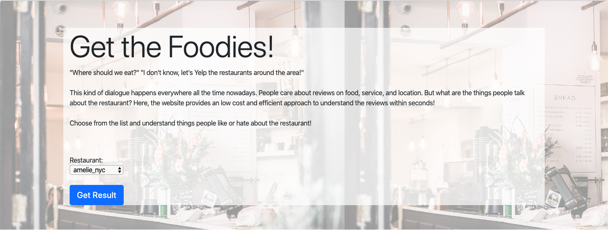

# Get the Foodies (demo)
> Get the Foodies is the web application for business owners, who have their business be listed on Yelp and have at least 10 pages of reviews, to understand what their customers like or dislike about the business. The sentiment analysis helps business owners understand what terms are associated with positive or negative reviews in order to strategize business operation plan for business purposes. 

## Table of contents
* [General info](#general-info)
* [Screenshots](#screenshots)
* [Technologies](#technologies)
* [Demo](#demo)
* [Features](#features)
* [Status](#status)
* [Contact](#contact)

## General info
The crowd-sourced review forum has become a crutial part of people's lives when looking for recommendations and solutions. According to the [study](https://www.reviewtrackers.com/reports/online-reviews-survey/) done in 2018, 80% of customers have lack of trust in business when the overall ratings are lower than 4 stars(5 star scale). As technology makes access to web ratings easily, more than 60% of customers read about reviews on interested business before visiting the business or requesting a service. 

The power of reviews motivates me to build the web application for business owner to know what their customers want through their reviews. The web app gives business owner the opportunity to learn what the most recent 200 reviews have talked about his/her business. It is designed to help business owners efficiently locate the issues raised by customers for improvements.

## Screenshots

## Technologies
* Scikit-learn - version 0.21.3
* Selenium - version 3.141.0
* Shap - version 0.30.0
* Matplotlib - version 3.1.1

## Demo
click [link](https://get-the-foodies.herokuapp.com/) to view demo web app 

## Features
List of features ready:
* Show 10 most relevant words associated with positive reviews based on its Shapley value 
* Show 10 most relevant words associated with negative reviews based on its Shapley value 
* Show how accuracy the model is 

To-do list for future development:
* Train the model for better results
* Make the web application workable by inserting the url link 

## Status
The project is ready for demo purpose, which users can choose from the drop down list and see the sentiment analysis for the selected restaurant. 
The project is in progress for analysis improvements. 

## Contact
Created by [@Erica Ho](https://www.linkedin.com/in/minyuericaho)